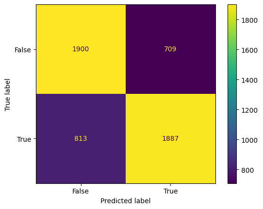

# League of Legends Competitive Matches Prediction

by Lucien Chen

## Framing the Problem

This project is a continuation of an exploratory data analysis of competitive league matches which can be found [here](https://lucienqchen.github.io/lol-match-analysis/).

Our goal in this project is to try and predict whether or not a League of Legends team will win a game since that is what ultimately determines a team's success and ability to generate revenue for its parent organization. Since we are trying to predict a binary variable, win/loss, we will be using a binary classification algorithm. We will be using accuracy as our as the metric to evaluate our model since there is no significant class imbalance (between Red side vs. Blue side).

Source: [data](https://oracleselixir.com/tools/downloads)

Before we start, we need to determine what kind of information we will use to train our model.

<iframe src="assets/gamelength.html" width=1000 height=600 frameBorder=0></iframe>

From this graph, we can see that games take at least about 15 minutes, and so any features we include in our model would need to be able to have been obtained a significant amount of time before the end of the game.

#### Cleaning the Data
The data cleaning process was very similar to that of the exploratory data analysis with some modifications.

Now that our data is a little cleaner, here's what each of our columns represent:
 - **playoffs**: whether or not a team made the playoffs
 - **league**: identifier of the tier and region the game was played in, for example the LCK is the Tier 1 league for Korea
 - **side**: which half of the map did the player or team play on, Blue or Red
 - **position**: the position a champion played
 - **champion**: the champion played
 - **win**: whether or not the player or team won
 - **kills**: number of kills for each player or team
 - **deaths**: number of deaths for each player or team
 - **assists**: number of assists for each player or team
 - **damagetochampions**: how much damage each player or team dealt to enemy champions
 - **damageshare**: how much of each players damage makes up the total damage 
 - **earnedgold**: how much gold each player or team earned
 - **golddiffat10**: how much of a gold (dis)advantage a player or team has at 10 minutes, relative to their opponent
 - **xpdiffat10**: how much of an experience (dis)advantage a player or team has at 10 minutes, relative to their opponent
 - **csdiffat10**: how much of a creep score (attained by killing minions or monsters) advantage a team or player has at 10 minutes
 - **killsat10**: how many kills a team has at 10 minutes
 - **deathsat10**: how many deaths a team has at 10 minutes
 - **assistsat10**: how many assists a team has at 10 minutes
 - **first_**: whether or not the team got the first _ (i.e tower, dragon, baron)

And here is what the first few rows of the cleaned up dataset look like:

|   playoffs | league   | side   | position   | win   |   killsat10 |   deathsat10 |   assistsat10 |   firstblood |   firstdragon |   firstherald |   firstbaron |   firsttower |   turretplates |     dpm |   golddiffat10 |   xpdiffat10 |   csat10 |   csdiffat10 |   opp_killsat10 |   opp_assistsat10 |   opp_deathsat10 |   kda_at_10 |   opp_kda_at_10 |   firstobjectives |
|-----------:|:---------|:-------|:-----------|:------|------------:|-------------:|--------------:|-------------:|--------------:|--------------:|-------------:|-------------:|---------------:|--------:|---------------:|-------------:|---------:|-------------:|----------------:|------------------:|-----------------:|------------:|----------------:|------------------:|
|          0 | LCK CL   | Blue   | team       | False |           3 |            0 |             5 |            1 |             0 |             1 |            0 |            1 |              5 | 1981.09 |           1523 |          137 |      322 |           -8 |               0 |                 0 |                3 |    8        |        0        |                 0 |
|          0 | LCK CL   | Red    | team       | True  |           0 |            3 |             0 |            0 |             1 |             0 |            0 |            0 |              0 | 2799.02 |          -1523 |         -137 |      330 |            8 |               3 |                 5 |                0 |    0        |        8        |                 0 |
|          0 | LCK CL   | Blue   | team       | False |           1 |            3 |             1 |            0 |             0 |             1 |            0 |            0 |              2 | 1690.98 |          -1619 |        -1586 |      317 |          -27 |               3 |                 3 |                1 |    0.666667 |        6        |                 0 |
|          0 | LCK CL   | Red    | team       | True  |           3 |            1 |             3 |            1 |             1 |             0 |            1 |            1 |              3 | 2124.55 |           1619 |         1586 |      344 |           27 |               1 |                 1 |                3 |    6        |        0.666667 |                 0 |
|          0 | LCK CL   | Blue   | team       | True  |           0 |            1 |             0 |            0 |             1 |             0 |            1 |            1 |              1 | 2049.98 |           -103 |          813 |      368 |           13 |               1 |                 1 |                0 |    0        |        2        |                 0 |

## Baseline Model

For our baseline model, we are going to start off with three variables: *golddiffat10*, *xpdiffat10* and *csdiffat10* which are all continuous, quantitative variables. Using a *sklearn* Pipeline, we standardize every variable using *sklearn's* StandardScaler and use it to fit a RandomForestClassifier. 

Our model achieves a baseline score of 0.6948 on the training data, and a baseline score of 0.6956 on the testing data.

Here are the feature importances of the baseline model. It seems that golddiffat10 is the most significant effect on the prediction.

|              |   feature_importances |
|:-------------|----------------------:|
| golddiffat10 |              0.469364 |
| xpdiffat10   |              0.349188 |
| csdiffat10   |              0.181448 |

## Final Model

In our final model, we created three new features for our model:
 - *kda_at_10*: defined as (total kills a team has at 10 + total assists a team has at 10) / total deaths a team has at 10
 - *opp_kda_at_10*: KDA at 10 minutes for the opponent
 - *firstobjectives*: which is the product of *firstbaron*, *firstdragon*, *firstblood* and *firstherald*; in other words, it is 1 only if the team got the first of the aforementioned features, and 0 otherwise

The KDA features encapsulate the kills, deaths and assists of the team and their opponents into variable, higher is better. It's also important to note that teams with 0 deaths have KDAs of (kills + assists) which is just a convention used by the League of Legends Community. The goal of this feature was to try to create way to measure the relative performance of a team.

The firstobjectives feature quantifies the advantage obtained by a team being able to secure all the first important objectives that may not otherwise be observed simply by looking at each objective individually.

In the final model, I decided to go to with a RandomForestClassifier again to see if adding more complexity and fine-tuning some parameters can improve the overall performance of our predictions. 

For our hyperparameter tuning, we are going to find the best number of estimators, n_estimators, the best criterion, and the best max_depth for each tree.

The reasoning is as follows: 

_**n_estimators**_ is a variable that determines how many individual trees are going to be fit in the forest, and so tuning this parameter will provide us with the optimal amount, since too little trees may not capture enough information and too many could, in rare instances, overfit. 

_**criterion**_ is a measure of error in our model and, in this instance, we are comparing entropy and the gini impurity whose main difference is that they have different intervals to determine splitting of nodes. 

_**max_depth**_ is the maximum depth that each tree in the forest is allowed to have. Very deep trees can overfit on the training data which may not translate to being able to make predictions with unseen data very well, whereas shallow trees may not capture enough information needed.

Using *sklearn's* built-in GridSearchCV, I found that the best parameters were using entropy as the criterion, using a max depth of 11 and using 110 estimators.

Overall, our model's performance significantly improved on the training data, achieving a score of 0.8030 whereas the performance only slighty improved on testing data, achieving a score of 0.7133. Regardless, our model was able to predict more accurately for both the training and testing datasets.

As before, here are the feature_importances for our model:

|                 |   feature_importances |
|:----------------|----------------------:|
| side            |             0.253494  |
| firstblood      |             0.173235  |
| kda_at_10       |             0.125195  |
| firstdragon     |             0.109401  |
| turretplates    |             0.0781413 |
| firsttower      |             0.0714681 |
| opp_kda_at_10   |             0.0651189 |
| firstobjectives |             0.0646498 |
| xpdiffat10      |             0.0210997 |
| golddiffat10    |             0.0138796 |
| csdiffat10      |             0.0127827 |
| firstherald     |             0.0115346 |

In this model, there are 6 qualitative, ordinal variables and 6 quantitative variables.

I've also included a confusion matrix below to show how our model performed on the test dataset.

## Fairness Analysis

An important thing to consider is the fairness of the algorithm, that is, when predicting on different groups, does our model perform differently? 

In our data, there are two primary "classes" so to speak, being whether a team playing on Red or Blue side. Since, there are an equal amount of games played on red side as there are on blue side, I used the difference in accuracy as the test statistic and chose a significance level of 5%.

<iframe src="assets/accuracy_by_side.html" width=1000 height=600 frameBorder=0></iframe>

Let's first define our question:

#### Does our model perform the same on a team regardless of which side they played on?

And our hypotheses:

Null Hypothesis: Our model is fair, it's accuracy is the same for both Blue and Red side and any differences are due to chance.

Alternative Hypothesis: Our model is not fair, it's accuracy for blue side is better than red side, and any differences are not due to random chance.

After conducting a permutation test, our p-value was 49.24%. In other words, the proportion of differences that were as extreme or more extreme than our observed difference in accuracy of -0.00173, was 49.24%.

Here is an accompanying visual of our permutation test:

<iframe src="assets/perm_test.html" width=1000 height=600 frameBorder=0></iframe>

We fail to reject the null hypothesis, our model is fair for regardless of side, at the 5% confidence level and it is likely that our model does perform fairly on either side.